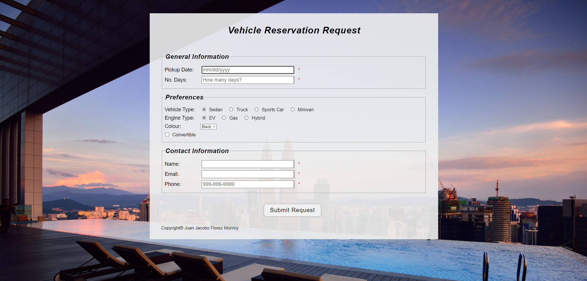

# 🚗 Vehicle Reservation Request System

## 📌 Project Overview

The **Vehicle Reservation Request System** is a **web-based application** that allows users to **reserve vehicles** by submitting a form with their preferences and contact information. The system features **dynamic validation, real-time feedback, and responsive design** to ensure a smooth user experience.

This project was developed as part of a **college assignment**, showcasing front-end development skills including **form validation, UI/UX design, and responsive layouts**.

---

## 🚀 Features

- 📝 **User-Friendly Form Interface** – Allows users to select **vehicle type, engine type, and color preferences**.
- 📆 **Reservation Details** – Users specify **pickup dates, rental duration, and contact information**.
- 🔍 **Dynamic Form Validation** – Checks for:
  - Valid **dates, numeric fields, emails, and phone numbers**.
  - **Real-time error feedback** to guide users.
- 📱 **Responsive Design** – Ensures usability across different screen sizes and devices.
- ✅ **Confirmation Page** – Displays a **success message** confirming the reservation request.

---

## 🛠 Technologies Used

- **HTML5** → Structures the form and confirmation pages.
- **CSS3** → Provides styling and responsive layout.
- **JavaScript (ES6)** → Implements validation logic and dynamic behavior.
- **jQuery** → Simplifies event handling and DOM manipulation.

---

## 🎯 Project Purpose

This project was developed as part of a **college assignment**, allowing me to:

- ✅ Implement **client-side validation** for user input.
- ✅ Enhance **form interactivity** with **real-time error feedback**.
- ✅ Apply **CSS Flexbox and Grid** for a structured and adaptive layout.
- ✅ Improve **user experience** through clear and responsive UI design.

---

## 📂 Project Structure

```
📁 vehicle_reservation
 ├── 📁 imgs/                # Image assets (backgrounds, icons, etc.)
 ├── 📄 index.html           # Main reservation form
 ├── 📄 response.html        # Confirmation page
 ├── 📄 reservation.css      # Stylesheet for layout and design
 ├── 📄 reservation.js       # JavaScript for validation logic
```

---

## 📝 Validation Details

The system ensures users provide **valid input** for the following fields:

1️⃣ **Pickup Date** → Must be in `MM/DD/YYYY` format and within a valid range.  
2️⃣ **No. of Days** → Requires numeric input for rental duration.  
3️⃣ **Name** → Ensures the field is not empty.  
4️⃣ **Email** → Validates format using regex.  
5️⃣ **Phone** → Requires format `999-999-9999`.  

⚠️ Validation errors are displayed **in real-time**, preventing form submission until all errors are resolved.

---

## 🏃‍♂️ How to Use the Application

1️⃣ **Open the Application** – Launch `index.html` in a web browser.  
2️⃣ **Fill Out the Form** – Enter the required information, including **preferences and contact details**.  
3️⃣ **Submit the Form** – Click **"Submit Request"**. If all inputs are valid, the user is redirected to `response.html`.  
4️⃣ **View Confirmation** – The confirmation page thanks the user and provides **next steps**.

---

## 🌟 Future Improvements

- 🔐 **Server-Side Validation** – Add back-end validation for security and error handling.
- 📂 **Database Integration** – Store reservation requests for administrative tracking.
- 📅 **Advanced Date Picker** – Replace manual date input with a modern date picker widget.
- 📧 **Email Notification** – Send confirmation emails upon successful reservation requests.

---

## 🎭 Screenshots  

| Vehicle Reservation System |  
|--------------|  
|  |  

---

## 📜 License

This project was developed for **educational purposes** as part of a **college assignment**.

---

## 💼 Author

👤 **Juan Jacobo Florez Monroy**  
🌐 **Portfolio**: [jjacobo95.com](https://jjacobo95.com)  
🐙 **GitHub**: [github.com/jjacoboflorez95](https://github.com/jjacoboflorez95)